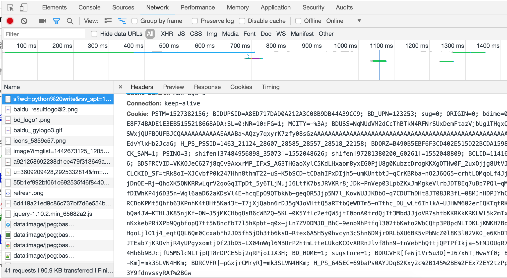

# 爬虫登录保持

#### 1. cookiejar的作用

cookiejar模块的主要作用是提供可存储cookie的对象，以便于与urllib模块配合使用来访问Internet资源。Cookiejar模块非常强大，我们可以利用本模块的CookieJar类的对象来捕获cookie并在后续连接请求时重新发送，比如可以实现模拟登录功能。

#### 2. 整体使用保持登录的思路

1. 首先请求网页,网页会有一些set-cookie的值返回给response

2. 收到response的值之后,使用cookiejar模拟浏览器的行为,保持 cookie

3. 在下一次登录的时候,带上信息和cookiejar保存的cookie信息反向的提交给浏览器,总之,cookiejar的作用就是模拟浏览器对cookie的行为

#### 3. 利用scrapy做登录权限的操作

1. 根据以上所示,就可以把浏览器里面的cookie拷贝在scrapy里面,然后让scrapy带上浏览器的信息,伪装成一个已经登录的用户去浏览页面

2. 具体代码如下:

	1. 拷贝浏览器中的cookie值,在浏览器中的network中去查看浏览器的请求报文(当然需要你自己去登录之后)

		
	
	2. 将上述信息(字符串)解析称为一个字典对象

		```python
		
			def make_cookie():
			    """
			    _zap=ed8fdabb-a5e5-4375-81bf-53de4867eb6f; _xsrf=6618b39f-a62a-49f9-9e4c-d0ca49e76c0f; d_c0="APBj--MIEg-PTh5tgwPzoIOQprzO0qNjxao=|1551688327"; q_c1=1ed7681be4dc41a7bf0025f89777f7a5|1551688331000|1551688331000; tgw_l7_route=a37704a413efa26cf3f23813004f1a3b; capsion_ticket="2|1:0|10:1552018691|14:capsion_ticket|44:MjdjNDk1YjIzOGM3NGYwMDlhZDg5ODc3MWFjYTkyYjU=|b5eac6728c8d9f79f0fffd5254f68b04680d4eced307136c30e07e5ead08da84"
			    :param cookie_str:
			    :return:
			    """
			    # 切割cookie
			    cookie_str = """_vwo_uuid_v2=E73FBA9D1E0B24AFB9E416F16905458C|8be41595fbeb90a66805b6f610ededaa; gr_user_id=9f7982d8-c300-4050-8918-921527796d1d; douban-fav-remind=1; __yadk_uid=UDNy2IE0u9DqIXWLJTrbJ5ADX3s8BAdU; bid=nFh4mrsWvFk; ll="118318"; __utmc=30149280; __utmz=30149280.1549113191.56.39.utmcsr=baidu|utmccn=(organic)|utmcmd=organic; viewed="26176870_2130743_1896753_26365491_3012360_7006537_1391207_4065258_26979890_20432061"; __utma=30149280.1781147576.1529479133.1549113191.1549957962.57; _pk_ref.100001.8cb4=%5B%22%22%2C%22%22%2C1552048916%2C%22https%3A%2F%2Fwww.baidu.com%2Flink%3Furl%3DxjhoqJVpmzViduo97iNZjOiUVB1zviO70sG5SwehT5m%26wd%3D%26eqid%3D8ced80bb0005b146000000055c826311%22%5D; _pk_ses.100001.8cb4=*; dbcl2="159658352:U4Qy4tU2x4c"; ck=_Mv3; ap_v=0,6.0; _pk_id.100001.8cb4=775ed02a7abf467f.1544620003.4.1552048969.1549693830.; push_noty_num=0; push_doumail_num=0"""
			    init_items = cookie_str.split(';')
			    # 把切割的cookie作为key value存储在dict中
			    items = dict()
			    for i in init_items:
			        k, v = i.split('=', 1)
			        items[k] = v
			
			    return items
		
		```
		
	3. 把上面的信息(cookie)加入到请求的request中即可

		```python
		
			    def start_requests(self):

			        cookie = make_cookie()
			        headers = {
			            'User-Agent': 'Mozilla/5.0 (Macintosh; Intel Mac OS X 10_14_3) AppleWebKit/537.36 (KHTML, like Gecko) Chrome/72.0.3626.119 Safari/537.36'
			        }
			        yield scrapy.Request(url="https://www.douban.com", headers=headers, cookies=cookie, callback=self.parse)
		
		```

