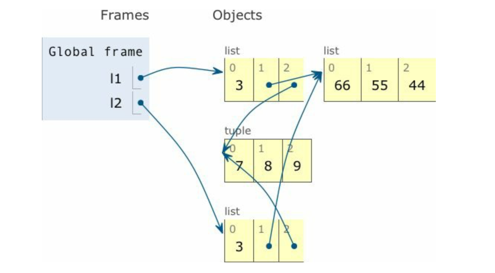

# python 对象和垃圾回收

#### 1. python变量的创建方式

1. python变量是对值的引用,而不是对值的拷贝

2. python对象的创建时从左至右的

	```
	class Gizmo:
	    def __init__(self):
	        print("Gizmo id :%d" % id(self))
	
	if __name__ == "__main__":
	    g = Gizmo()
	    print(Gizmo() * 10)
	```
	
	可以看到输出结果为
	
	```
	Gizmo id :4437756728
	Gizmo id :4437821368
	  File "/Users/canvas/playground/fulent_python/c8/test1.py", line 7, in <module>
	    print(Gizmo() * 10)
	TypeError: unsupported operand type(s) for *: 'Gizmo' and 'int'
	
	```
	
	>说明代码是从左至右运行的,因为他执行了两次创建对象的代码,但是没有创建对象y,所以他是先创建对象或者值,然后再把标签(y) 贴上去
	

#### 2. ==和is之间的区别

1. 标识和值的区别

	python会内置id这个函数,id(a)会返回a的整数标识

	> cpython中,id返回的对象的内存地址,其他解释器中可能有不同的实现
	
2. ==,is之间的差别

	is调用的是两个函数的id是否相等,==调用的是 ```__eq__()```,方法,这个方法有自己内部的很多逻辑,先是调用id是否相等,如果id不相等,他不会立即返回false,而是继续执行其他逻辑,比如比较他们的地址指向的值,是否相等
	
	
3. 其他情况

	https://segmentfault.com/q/1010000015117621/a-1020000015145284
	
#### 3. 元祖不可变性的理解

```
str,bytes,array.array
```
为什么是扁平数据类型,因为他们保存的不是引用,而是在连续的内存中保存的数据本(就像 int a,char b一样)

而tuple里面如果保存的是list这种序列类型,那么他保存的不是数据本身,而是数据的地址(int *,char *) 这种

<strong>综上所述,tuple确实是不可变的,但是他存入list的时候,他存储的list的引用地址(如指针类型)，只要引用地址不变，就不会报错,引用地址所指向的内容当然是可以随意改变的</strong>

可以看如下代码

```
t1 = (1,2,[30,40])
t2 = (1,2,[30,40])

print(id(t1[-1]))
print(id(t2[-1]))

print('----------')
print(id(t2[0]))
print(id(t1[0]))

```

输出为

```
4419415176
4419415240
----------
4399941680
4399941680
```

>可以看到,list是两个不同的地址,但是1，2的地址是一样的,因为1 2现在内存中创建好的数值,id算法直接计算hash(__hash__())

所以可以去修改tuple里面list的值,而不会报错,当然是因为引用地址不变咯

```
t2 = (1,2,[30,40])
t2[-1].append(-3)
print(t2)

```
#### 4. 默认做浅复制

```
l1 = [3,[55,44],(7,8,9)]
l2 = list(l1)

l1[1].append(89)
print(l1)
print(l2)
```
可以看到输出是一样的,至于为什么一样,看下图



在大脑里面记住,l1,l2其实都死引用的地址,l2默认做复制,是不会复制真正的值的,而是去复制l1里面指向的地址的值

哪些是浅复制

1. 直接复制等于 l2 = l1
2. 切片 l2 = l1[:]
3. copy.copy

#### 5. 深复制

1. 先看书上一个实例

	```
	import copy
	
	class Bus:
	
	    def __init__(self,passengers=None):
	        if passengers is None:
	            self.passengers = []
	        else:
	            self.passengers = list(passengers)
	
	    def pick(self,name):
	        self.passengers.append(name)
	
	    def drop(self,name):
	        self.passengers.remove(name)
	
	bus1 = Bus(["Alice","Bill","Claire","David"])
	bus2 = copy.copy(bus1)
	bus3 = copy.deepcopy(bus1)
	
	bus1.drop('Alice')
	print(bus1.passengers)
	print(bus2.passengers)
	print(bus3.passengers)
	```
	
	>可以看到上面的结果,bus2浅复制了bus1,所以和bus1共享了list中的值,造成了这种情况
	
2.  不要使用可变类型作为参数的默认值

	```
	
	class HauntBus:

    def __init__(self,pas=[]):
        self.pas = pas

    def pick(self,name):
        self.pas.append(name)

    def drop(self,name):
        self.pas.remove(name)

	
	bus1 = HauntBus()
	bus1.pick('aaaaa')
	bus2 = HauntBus()
	
	print(bus1.pas)
	print(bus2.pas)
	
	```
	
	>我们在声明的时候,给出了一个空[]作为默认值,这样是不行的,因为当不传参数的时候,会传递到默认给出的[]中,所以bus1和bus2共享了变量
	
3. 所以优化的代码还是去判断是否为None,如果为None的话,去新建一个[],如果不为None,则去做一次浅复制(或者深复制)即可

	```
	class HauntBus:

    def __init__(self,pas=None):
        if self.pas is None:
            self.pas = []
        else:
            self.pas = list(pas)

    def pick(self,name):
        self.pas.append(name)

    def drop(self,name):
        self.pas.remove(name)

	
	bus1 = HauntBus()
	bus1.pick('aaaaa')
	bus2 = HauntBus()
	
	print(bus1.pas)
	print(bus2.pas)

	
	```
	
#### 6 垃圾回收

1. del用法原理

	1. del语句删除的是名称(对象的引用),而不会去删除对象实际的值。
	2. 对象如果没有变量去引用,那么对象很可能会被python的垃圾回收器删除

2. 删除算法
	1. Cpython中,垃圾回收使用的主要算法是引用计数。就是说如果么有引用(标签)贴在变量上面的时候,引用计数归零,对象被销毁
	2. 

