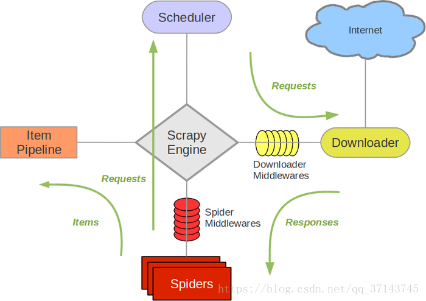
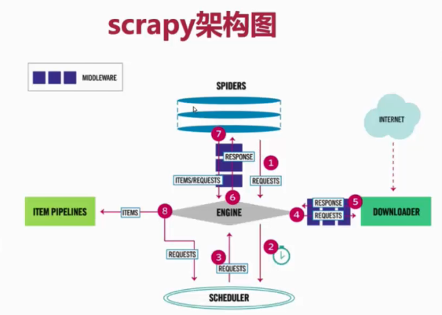

# scrapy运行图

###图的含义：

1. Spiders(爬虫):它负责处理所有Responses,从中分析提取数据，获取Item字段需要的数据，并将需要跟进的URL提交给引擎，再次进入Scheduler(调度器)
Engine(引擎)：负责Spider、ItemPipeline、Downloader、Scheduler中间的通讯，信号、数据传递等。
2. Scheduler(调度器)：它负责接受引擎发送过来的Request请求，并按照一定的方式进行整理排列，入队，当引擎需要时，交还给引擎。
3. Downloader(下载器)：负责下载Scrapy Engine(引擎)发送的所有Requests请求，并将其获取到的Responses交还给Scrapy Engine(引擎)，由引擎交给Spider来处理
ItemPipeline(管道):它负责处理Spider中获取到的Item，并进行进行后期处理（详细分析、过滤、存储等）的地方.
4. Downloader Middlewares（下载中间件）：你可以当作是一个可以自定义扩展下载功能的组件。
5. Spider Middlewares（Spider中间件）：你可以理解为是一个可以自定扩展和操作引擎和Spider中间
通信的功能组件（比如进入Spider的Responses;和从Spider出去的Requests）

### 执行流程

1. 用scrapy框架的时候，一定要先明白执行的顺序，代码已写好，程序开始运行~

2. SPIDERS的yeild将request发送给ENGIN

3. ENGINE对request不做任何处理发送给SCHEDULER

4. SCHEDULER( url调度器)，生成request交给ENGIN

5. ENGINE拿到request，通过MIDDLEWARE进行层层过滤发送给DOWNLOADER

6. DOWNLOADER在网上获取到response数据之后，又经过MIDDLEWARE进行层层过滤发送给ENGIN

7. ENGINE获取到response数据之后，返回给SPIDERS，SPIDERS的parse()方法对获取到的response数据进行处理，解析出items或者requests

8. 将解析出来的items或者requests发送给ENGIN

9. ENGIN获取到items或者requests，将items发送给ITEMPIPELINES，将requests发送SCHEDULER 注意！只有当调度器中不存在任何request了，整个程序才会停止，（也就是说，对于下载失败的URL，Scrapy也会重新下载。）
