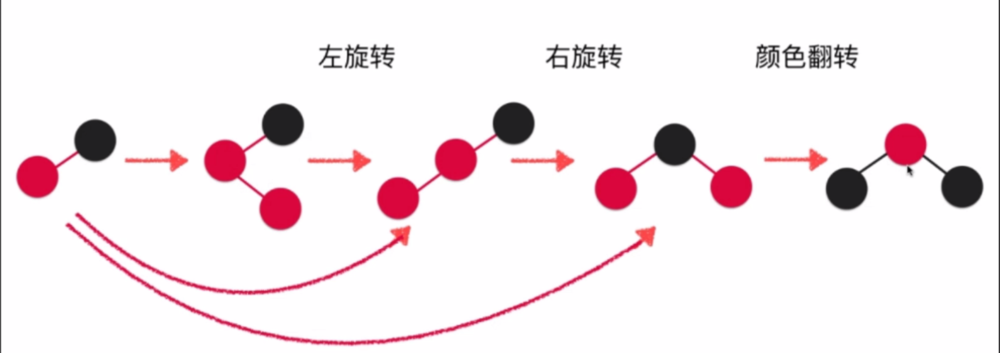

# 红黑树

#### 2 3树

1. 2 3树维护这样一种节点的树,每个节点可以容纳 1 - 2 个元素，2 - 3子节点。如下图。2 3树依然维护着BST的性质。 向 68 这个节点可以容纳三个子元素。我们就称之为 3节点。 7这种节点可以容纳两个子元素。我们就称之为 2节点

	```
	     |6 8|
	    /   |  \	
	  |2 5| 7   12
	
	```
	
2. 2 3树的节点添加操作,2 3树原则是不会把节点添加到一个空节点中,所以说,如果节点下面子树是空,是不会把节点添加到子树中,而是遵照上面的原则,把节点添加到非空中节点中。但是添加到非空节点中,会出现节点不符合 2 3树的定义，这个时候我们就需要节点的变形操作

	>将66添加到 37 42节点中,由于 37 42没有子元素,那么就只能添加到本节点中。然后做变形操作
	
	```
	 66  -->  |37 42 | ---> |37 42 66|
	
	```
	
	>变形操作
	
	```
			42
		  /   \
		37     66  
	```
	
	
	另外一种变形,假设刚才的变形成功后。我们继续插入更多的节点,导致分裂后的节点满了。那么就需要另外一种的变形。
	
	```
	        |6 8|
	      /   |   \      
 	   |2 5|  7    12
	```
	
	>插入4节点。和上面一样 为了满足 2 3树的性质。需要变形操作
	
	```
		     |6 8|
	      /   |   \      
 	 |2 4 5|  7    12
	
	```
	
	
	```
		   |4 6  8|
	      / /  |   \      
 	     2  5  7    12
	
	```
	
	>最后分裂成 满足 2 3 树的树形状
	
	```
	          6
	        /   \
          4	     8
         / \    / \
        2   5  7   12
          
          
	```
	
3. 2 3树的绝对平衡性

	> 我们在下面节点插入 6这个值
	
	```
	
		  37
	  /     \	
  |12 18|   42
  
	```
	
	> 6比37小,找左节点,左节点中已满,但是也没子节点所以还是和上面一样 做分裂
	
	```
	        37
	  
	      /     \  
	
     |6 12 18 |   42	
  
	```
	
	>根据上面的知识点 可以做这样的分裂 但是这样的分裂有问题,我们称 2 3树是绝对平衡二叉树
	
	```
					37
	  
	      		 /     \  
	         12       42
	        /  \
           6   18      
	
	
	```
	
	>再去做融合,保证绝对平衡性
	
		
	```
				   |12 37|
	      		 /    |    \  
	          6     18    42
	            
	
	
	```
	
	>继续添加元素 5 11
	
	```
				   |12 37|
	      		 /    |    \  
	         5 6    18    42
	```
	
	>
	
	```
				    |12 37|
	      		 /     |     \  
	       |5 6 11|   18     42
	```
	
	>
	
		
	```
				    |12 37|
	      		 /     |     \  
	          6       18     42
	        /  \
	       5    11
	```
	
	
	```
				   |6  12  37|
	      		 /   |    |     \  
	          5     11    18     42

	```
	
	
	
		
	```
	          12
	        /   \
          6	    37
         / \    / \
        2   11  18   42
          
          
	```
	
4. 这样 2 3树虽然有多种情况要判断,要去分裂融合元素。但是他比起AVL少了旋转的操作。

	
	
	
#### 红黑树

1. 红黑树其实就是 2 3 树的等价树。由于我们看到上面的2 3树需要很多的操作来完成。而且如果一节点上面有两个值之后。就会出现一些判断情况。这是比较复杂的操作。那么红黑树就可以用来代替 2 3树。怎么代替呢。红黑树用红色节点来表示和黑色节点在同一层。

	```
	        |6 8|
	      /   |   \      
 	   |2 5|  7    12
	```
	
	>红黑树的表达,上面的 2 3树种 6 8 在同级，那么在二叉树中我们就可以用颜色红色来表示同级。这样就可以替代2 3树
	
	```
	
	       8(b)
	      /    \
	     6(r)  12(b)
	    /  \
	   5(b) 7(b) 
	  /
	 2(r)    
	
	```
	
	> 定义 
	
	> 1. 红色节点一定在左边
	
	
	
	
2. 红黑树的更多性质

	1. 红色节点下面的两个自节点都是黑色节点(根据定义1 推导)
	2. 根节点一定是黑色
	3. 每个节点或是黑色或者是红色
	4. 任意一个节点到叶子节点经过的黑色节点数量是一样的
	5. 空节点是黑色（NIL） 其实就是认为None是黑色

3. 红黑树结论

	1. 红色树不一定是平衡二叉树
	2. 但是红黑树一定是黑平衡 根据上面性质推出
	3. 最大高度是 2logn  其实也是O(logn)级别的复杂度
	4. AVL树适合查询较多的操作 (AVL的高度其实比红黑树低)
	5. 红黑树适合插入和插入综合都比较多的操作,红黑树的统计复杂度更低

#### 红黑树细节

####1. 红黑树的添加元素

1. 找点非空叶子节点,做融合

2. 如果是2节点:
	
	1. 如果添加的元素比原来的元素小,那么直接添加即可,添加的元素也保持红色即可
	2. 如果添加的元素比原来的元素大,那么添加的元素会添加到原来的元素的后面,这样导致了原来的元素右边指向了一个红色节点,违反了定义,需要进行左旋,和变颜色,保持红黑树的定义。旋转后 x变成原来节点的颜色,原来的节点变成红色(表示在x的左边平级)

		```
		    node                x
	       /    \             /  \
	      T1    x   --->   node  T3
	           / \          /  \
	          T2 T3        T1  T2
		
		```
		
		> 对应代码
		
		```
		
		def _left_rotate(self,node):
	        """
	        node                x
	       /    \             /  \
	      T1    x   --->   node  T3
	           / \          /  \
	          T2 T3        T1  T2
	
	        :param node:
	        :return:
	        """
	        x = node.left
	        node.right = x.left
	        x.left = node
	        x.color = node.color
	        node.color = RED
	        return x
		
		```

	
3. 如果是3节点

	1. 最简单的情况，向后添加一个最大的元素,比如 ``` 66--> |37 42 | ``` ,如下图,其实整个过程是颜色的改变,并没有旋转

		根据23树的性质最终变成
		
		```
			 42(B)
		   /       \
		 37	(R)   66(R)
		 
		```
		
		>根据红黑的定义 和 2 3 4的定义  2 3树分裂成了三个单独的节点,那么在红色树种表示的是三个黑色节点
		
		```
			 42(B)
		   /       \
		 37	(B)   66(B)
		 
		```
		
		> 2 3树完成之后,就会开始去向上做融合操作,所以根节点变成红色
		
		```
			  42(R)
		   /       \
		 37	(B)   66(B)
		 
		```
		
		>对应代码
		
		```
		
		def _flip_colors(self,node):
	        node.color = RED
	        node.left.color = BLACK
	        node.right.color = BLACK
	        return node
		```
		
	2. 当发生  12 ->|32 44|时 会变成  |12 32 44| 然后分析。

		相当于红黑树发生了这样的情况y要插入到树种
		
		```
		
			node                node
		 	/       --->       /
		  x                  x
		                    /
		                   y 
		                 
		``` 
		
		>基于上面情况的 2 3树会发生这种情况
		
		```
		
		  | 12  32   44|
		                   ---->      32
		                             /  \ 
		                            12   44
		                                
		                                
		                                                     
		```  
		
		>那么换成红黑树会发生下面的情况 ,x变为根节点,代替原来的根节点,原来的根节点和 x融合 所以颜色变为红色,那么可以理解为右旋转,最后调用之前的翻转颜色
		
		```
		
		    node             x
           /  \            / \
          x   T2  -->     y  node
         / \                 /  \
        y  T1        
		```   
		
		>代码
		
		```
		    def _right_rotate(self,node):
		        """
		           node             x
		           /  \            / \
		          x   T2  -->     y  node
		         / \                 /  \
		        y  T1               T1  T2
		       :param node:
		        :return:
		        """
		
		        x = node.left
		        t1 = x.right
		
		        node.left = t1
		        x.right = node
		
		        x.color = node.color
		        node.color= RED
		
		        return x
			
		
		```
		
	3. 当发生 ```  30 -->  |18 42|   ```

		>在红黑树中相当于这样
		
		```
		     
		      42(B)
		     / 
		   18(R)
		     \
		      30(R)
		```
		
		>处理是类似AVL的 LR 先左旋转再右旋转即可
		
		```
		        42(B)
		        /
		       30(R)
		       /
		      18(R) 
		```
		
		>再右旋转
		
		```
		      30(B)
		     /     \
		   18(R)    42(R)
		
		```
		>之后再颜色翻转,让30为R 18 42为B 30向上做融合即可


#### 添加元素逻辑梳理

对于所有的元素通用,如果节点的右节点为红色,并且左节点不为红色 左旋转这个节点

变成上面的图形之后,查看是否需要右旋转图形 然后再查看是否需要翻转颜色 这样递归调用就可以完成对所有的情况的通用性



>代码

```
    def _add(self, node, val):
        if node is None:
            self.size += 1
            return Node(val)

        if node.val > val:
            node.left = self._add(node.left, val)
        elif node.val < val:
            node.right = self._add(node.right, val)

        if(self._is_red(node.right) and not self._is_red(node.left)):
            node = self._left_rotate(node)

        if (self._is_red(node.left) and self._is_red(node.left.left)):
            node = self._right_rotate(node)

        if(self._is_red(node.right) and  self._is_red(node.left)):
            node = self._flip_colors(node)


        return node

```

#### 整体代码


```
RED = True
BLACK = False


class Node:
    def __init__(self, val):
        self.val = val
        self.left = None
        self.right = None
        # 初始化的时候,把颜色指定为红色,红色表示去融合,2 3树的所有节点都是先融合再变形
        self.color = RED


class RBTree:
    def __init__(self):
        self.root = None
        self.size = 0

    def add(self, val):
        self.root = self._add(self.root, val)
        # 保持根节点永远是黑色
        self.root.color = BLACK

    def _add(self, node, val):
        if node is None:
            self.size += 1
            return Node(val)

        if node.val > val:
            node.left = self._add(node.left, val)
        elif node.val < val:
            node.right = self._add(node.right, val)

        if(self._is_red(node.right) and not self._is_red(node.left)):
            node = self._left_rotate(node)

        if (self._is_red(node.left) and self._is_red(node.left.left)):
            node = self._right_rotate(node)

        if(self._is_red(node.right) and  self._is_red(node.left)):
            node = self._flip_colors(node)


        return node

    def _is_red(self,node):
        if node is None:
            return BLACK
        return node.color == RED
    #当融合的时候, 2 3树种 插入的元素比原来的元素要大
    # 而且红色节点在node的右边,这样不符合性质
    #那么就进行会把两个元素互换位置,对应红黑的里面的左旋转

    #   x（r） ->| node(b) | -->|node(b) x(r) | --> | node(r) x(b) |
    def _left_rotate(self,node):
        """
        node                x
       /    \             /  \
      T1    x   --->   node  T3
           / \          /  \
          T2 T3        T1  T2

        :param node:
        :return:
        """
        x = node.right
        node.right = x.left
        x.left = node
        x.color = node.color
        node.color = RED
        return x

    def _flip_colors(self,node):
        node.color = RED
        node.left.color = BLACK
        node.right.color = BLACK
        return node

    def _right_rotate(self,node):
        """

        当发生  12 ->|32 44|时 会变成  |12 32 44|-->然后会变成

                32
               /  \        -->然后翻转颜色 然后向上做融合
            12(R)  44(R)


            --------------------------
           node             x
           /  \            / \
          x   T2  -->     y  node
         / \                 /  \
        y  T1               T1  T2
       :param node:
        :return:
        """

        x = node.left
        t1 = x.right

        node.left = t1
        x.right = node

        x.color = node.color
        node.color= RED

        return x


```


#### 更多红黑树的话题

1. 删除节点

2. 伸展树


