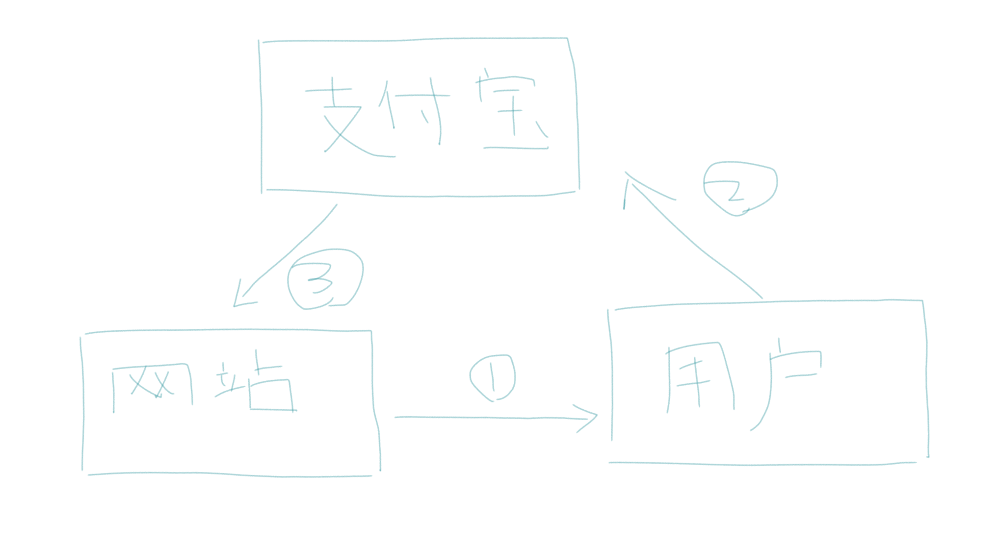
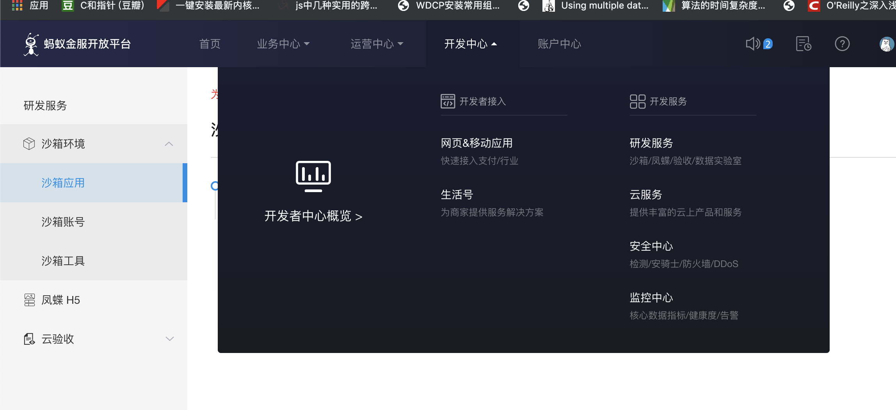
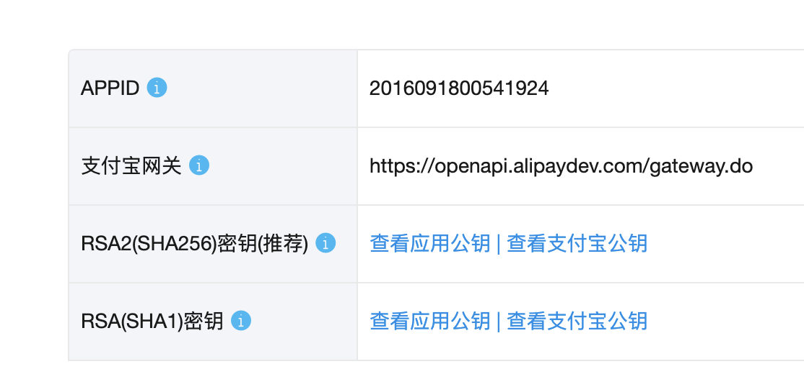

# 支付宝支付

#### 1. 支付宝支付整体流程

1. 在支付宝申请支付账户,由于支付宝实际支付需要企业并提交营业执照。所以使用沙葙测试模式来支付（实际真实环境和沙葙模式一模一样，不过实际上线给钱就是真的给钱）

2. 根据支付宝付的api文档生成相应的支付链接，让用户付款

3. 部署服务器，让服务器接受支付宝的通知，来判断支付是否成功

4. 支付基本流程和架构

	
	
	> 整体思路就是用户给支付宝钱，支付宝收到用户的钱之后，再通知服务器用户是否已经支付，服务器根据支付宝的通知（回调），判断用户的订单，然后发货，最后商家去支付宝后台提钱。
	
#### 2. 商家申请支付宝账户流程

1. 在蚂蚁金服平台注册账户

	```
	https://openhome.alipay.com/platform/home.htm
	```
	
2. 在蚂蚁金服中申请沙葙测试

	
	
3. 在蚂蚁沙葙中去配置支付宝公钥

	生成共钥步骤,安装openssl 完成后输入命令生成公钥私钥
	
	```
	OpenSSL> genrsa -out app_private_key.pem 2048  # the private key file
	OpenSSL> rsa -in app_private_key.pem -pubout -out app_public_key.pem # export public key
	OpenSSL> exit
	```
	
	注意公钥格式,如下
	
	```
	-----BEGIN PUBLIC KEY----- and -----END PUBLIC KEY-----
	```
	
4. 把publickey 提交到支付中

	
	
5. 下载沙葙测试app

#### 3. 支付代码逻辑

1. 需要生成流水号，流水号表示的是用户的未付款订单，把流水号和支付金额生成为支付宝要求的支付链接格式。发送给用户。用户点开链接后就可以扫码付款

2. 回调，上面步骤生成的流水号表示未付款状态。之后用户付款后，把流水号原封不动的通知服务器，服务器才知道用户对哪个订单已经付款。（订单可以有很多个 也可以不用付款 ）

	代码：

	```
	
	from alipay import AliPay
	from movies.settings import BASE_DIR
	import os
	app_private_key_string = open(os.path.join(BASE_DIR,'app_private_key.pem')).read()
	alipay_public_key_string = open(os.path.join(BASE_DIR,'app_public_key_ali.pem')).read()
	
	test_appid = "2016091800541924"
	appid = "2018080760940390"
	alipay = AliPay(
	    appid=test_appid,
	    app_notify_url=None,  # 默认回调url
	    app_private_key_string=app_private_key_string,
	    # 支付宝的公钥，验证支付宝回传消息使用，不是你自己的公钥,
	    alipay_public_key_string=alipay_public_key_string,
	    sign_type="RSA2", # RSA 或者 RSA2
	    debug=False  # 默认Fallse
	
	)
	
	order_string = alipay.api_alipay_trade_page_pay(
	    out_trade_no="20161112",
	    total_amount=0.01,
	    subject="加钱",
	    notify_url="http://www.baidu.com" # 可选, 不填则使用默认notify url
	)
	
	http = "https://openapi.alipay.com/gateway.do?"
	http_dev = "https://openapi.alipaydev.com/gateway.do?"
	print(http_dev+order_string)
	
	
	```
	
3. 代码解释：

	1. app_private_key_string 按照刚才的生成公钥私钥的方式读取到变量中， appid为商户的id号，每个都有独立的id号。
	2. 把支付宝要求的参数组合然后加密成要求的格式。生成链接给用户。这个时候用户打开这个网站就会看到二维码。扫码支付

#### 支付宝链接生成的要求


https://docs.open.alipay.com/api_1/alipay.trade.pay


